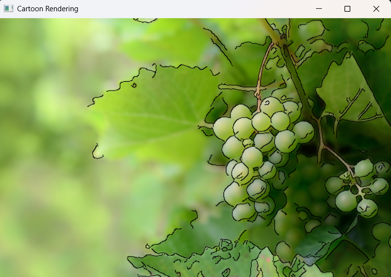
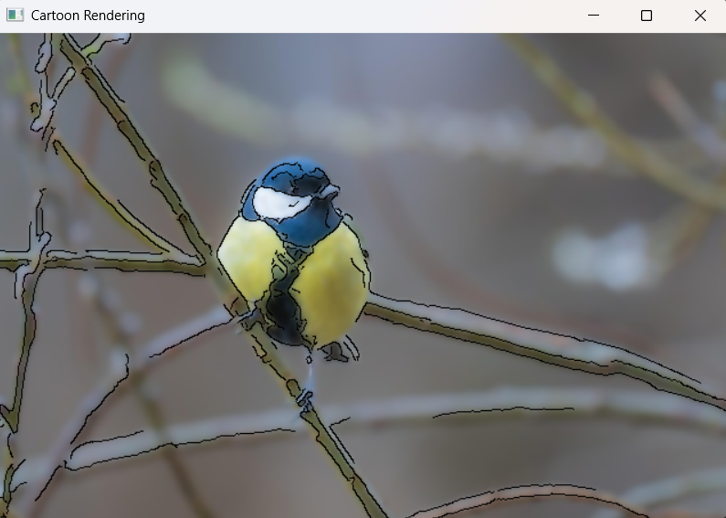

# cartoon_rendering_OpenCV
Simple cartoon rendering using OpenCV

## 기능
```
edges = cv2.Canny(gray, 500, 1200, apertureSize=5)
```
경계선을 추출합니다.
```
edges = 255 - edges
```
배경을 흰색, 선을 검은색으로 만듭니다.

## 데모
잘 표현되는 이미지  
  
잘 표현되지 않는 이미지  


## 한계점
* 외곽선이 잘 그려지지 않습니다.
* 만화 같은 느낌이 부족합니다.

## 사진 출처
[pixabay 새](https://pixabay.com/ko/photos/%ec%83%88-%ea%b9%83%ed%84%b8-%eb%82%98%eb%ad%87-%ea%b0%80%ec%a7%80-%ec%9a%b0%eb%8a%94-%ec%83%88-8620213/)  
[pixabay 과일](https://pixabay.com/ko/photos/%ea%b3%bc%ec%9d%bc-%ed%8f%ac%eb%8f%84-%eb%8d%a9%ea%b5%b4-%ea%b1%b4%ea%b0%95%ed%95%9c-6630377/)